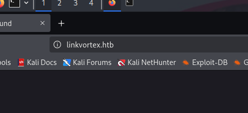

# LinkVortex

## Reconnaissance

I began with a basic port scan using **nmap**, focusing on the most common services:

```bash
PORT   STATE SERVICE REASON         VERSION
22/tcp open  ssh     syn-ack ttl 63 OpenSSH 8.9p1 Ubuntu 3ubuntu0.10 (Ubuntu Linux; protocol 2.0)
| ssh-hostkey: 
|   256 3e:f8:b9:68:c8:eb:57:0f:cb:0b:47:b9:86:50:83:eb (ECDSA)
| ecdsa-sha2-nistp256 AAAAE2VjZHNhLXNoYTItbmlzdHAyNTYAAAAIbmlzdHAyNTYAAABBBMHm4UQPajtDjitK8Adg02NRYua67JghmS5m3E+yMq2gwZZJQ/3sIDezw2DVl9trh0gUedrzkqAAG1IMi17G/HA=
|   256 a2:ea:6e:e1:b6:d7:e7:c5:86:69:ce:ba:05:9e:38:13 (ED25519)
|_ssh-ed25519 AAAAC3NzaC1lZDI1NTE5AAAAIKKLjX3ghPjmmBL2iV1RCQV9QELEU+NF06nbXTqqj4dz
80/tcp open  http    syn-ack ttl 63 Apache httpd
| http-methods: 
|_  Supported Methods: GET HEAD POST OPTIONS
|_http-server-header: Apache
|_http-title: Did not follow redirect to http://linkvortex.htb/
Service Info: OS: Linux; CPE: cpe:/o:linux:linux_kernel
```

The scan revealed two exposed services:

- **SSH (port 22)** running OpenSSH 8.9p1.
- **HTTP (port 80)** running Apache.

## Enumerating HTTP

When accessing the web application via a browser, I was automatically redirected to `http://linkvortex.htb/`:

 *Screenshot of the redirect to linkvortex.htb*

To make this work locally, I added the domain to `/etc/hosts`:

 *Screenshot showing the /etc/hosts file update*

Suspecting the presence of subdomains, I performed a brute-force attack using tools like `ffuf`:

 *Screenshot of ffuf subdomain brute-force results*

This revealed the subdomain `dev.linkvortex.htb`, which I also added to `/etc/hosts`:

 *Screenshot showing the /etc/hosts update for dev.linkvortex.htb*

Upon accessing `http://dev.linkvortex.htb/`, I encountered a site with simple static pages, suggesting it might be a development or staging version of the main project:

 *Screenshot of the dev.linkvortex.htb webpage*

Next, I conducted **directory fuzzing** to identify potential entry points or hidden pages:

 *Screenshot of directory fuzzing results*

I discovered an exposed `.git` directory—a common mistake when developers fail to configure `.gitignore` properly. This exposure could allow retrieval of the entire source code.

## Exploring the .git Directory

I downloaded the entire `.git` directory and dumped the code into a `source` folder:

 *Screenshot showing the .git directory download process*

Using `git status`, I found modified but uncommitted files:

 *Screenshot of git status output*

Inspecting one of the files revealed that the **Ghost** CMS was running inside a Docker container:

 *Screenshot of the file revealing Ghost CMS in Docker*

## Obtaining Credentials

In the modified code, I found a password. Assuming it was removed in a previous commit, I used:

 *Screenshot of the initial git command to check commit history*

And then, with: `git log ghost/core/test/regression/api/admin/authentication.test.js`

I saw that the commit making the change was, fortunately, the only one:

 *Screenshot of git log output*

Then, I ran `git diff [COMMIT] -- ghost/core/test/regression/api/admin/authentication.test.js` and confirmed that a password had been removed in an earlier commit, as I suspected:

 *Screenshot of git diff showing the removed password*

## Accessing the Ghost CMS

The Ghost CMS was accessible at the root domain (`http://linkvortex.htb/`), not the `dev` subdomain:

 *Screenshot of the Ghost CMS login page*

Attempting to log in with the credentials we found failed:

 *Screenshot of failed login attempt*

I tried logging in with the discovered password, but it didn’t work. Then, I tested common email addresses, such as `admin@linkvortex.htb`, and succeeded:

 *Screenshot of successful login to Ghost CMS*

Searching for ways to upload a shell or exploit CVEs based on the version found in the Docker file, I identified this CVE:

 *Screenshot of CVE-2023-40028 details*

> Ghost-5.58-Arbitrary-File-Read-CVE-2023-40028/CVE-2023-40028 at master · 0xDTC/Ghost-5.58-Arbitrary-File-Read-CVE-2023-40028
> 
> 
> [Ghost-5.58-Arbitrary-File-Read-CVE-2023-40028](https://github.com/0xDTC/Ghost-5.58-Arbitrary-File-Read-CVE-2023-40028/blob/master/CVE-2023-40028)
> 


And it worked:

 *Screenshot of successful CVE exploitation*

One of the items in the Docker configuration file was a copy of a file named `production`:

 *Screenshot of the production file in the Docker configuration*

When attempting to read this file, I retrieved credentials for a user named `bob`:

 *Screenshot of retrieved credentials*

The first thing I did was try logging in via SSH, and I succeeded:

 *Screenshot of successful SSH login*

The first thing I did was check `sudo` permissions:

 *Screenshot of sudo permissions output*

Inspecting the code:

```bash
#!/bin/bash

QUAR_DIR="/var/quarantined"

if [ -z $CHECK_CONTENT ];then
  CHECK_CONTENT=false
fi

LINK=$1

if ! [[ "$LINK" =~ \.png$ ]]; then
  /usr/bin/echo "! First argument must be a png file !"
  exit 2
fi

if /usr/bin/sudo /usr/bin/test -L $LINK;then
  LINK_NAME=$(/usr/bin/basename $LINK)
  LINK_TARGET=$(/usr/bin/readlink $LINK)
  if /usr/bin/echo "$LINK_TARGET" | /usr/bin/grep -Eq '(etc|root)';then
    /usr/bin/echo "! Trying to read critical files, removing link [ $LINK ] !"
    /usr/bin/unlink $LINK
  else
    /usr/bin/echo "Link found [ $LINK ] , moving it to quarantine"
    /usr/bin/mv $LINK $QUAR_DIR/
    if $CHECK_CONTENT;then
      /usr/bin/echo "Content:"
      /usr/bin/cat $QUAR_DIR/$LINK_NAME 2>/dev/null
    fi
  fi
fi
```

The script checks for symbolic links pointing to `root` or `etc`. To bypass this, I had to create a chained symbolic link pointing to another link, and I successfully obtained the root flag, as shown below:

 *Screenshot of the root flag*
